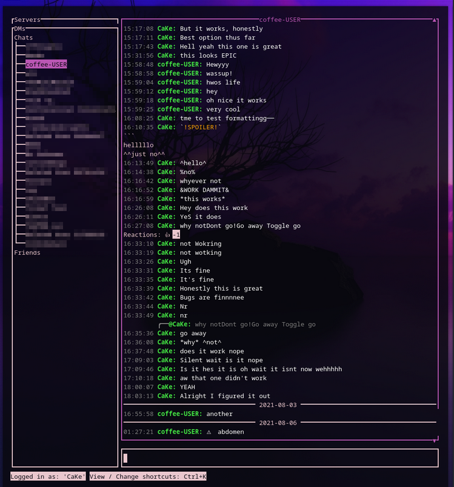

# pywal-gord
Themes gord with colors generated by pywal
## Installation
```bash
git clone https://github.com/belkarx/pywal-gord.git
cd pywal-gord
#optionally, build the binary with 'go build -ldflags "-s -w" .'
./pywal-gord > ~/.config/gord/theme.json
```
## Notes
This also works with cordless, just replace the `> ~/.config/gord/theme.json` with `> ~/.config/cordless/theme.json`

Run this script every time you reload your wal so your colors remain updated

## Images
The effect that this script has on coloring:

### Example 1
Before:



After:


### Example 2
Before:


After:


